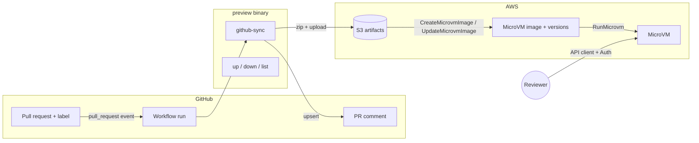
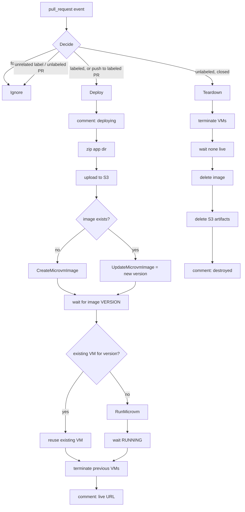

# Architecture

PReview turns a pull request (or branch) into a running **AWS Lambda MicroVM** and reports the endpoint URL back on the PR. It is a single Go binary (`preview`) that is used both as a CLI and, via [`action.yml`](../action.yml), as a GitHub Action.

It is modelled on [pullpreview/action](https://github.com/pullpreview/action): a label turns a preview on, pushes redeploy it, removing the label or closing the PR destroys it, and one marker-based PR comment tracks the state. Instead of a Lightsail VM running docker-compose, the environment is a Firecracker MicroVM built from the repository's own `Dockerfile`.

## Component map



## Package layout

| Package | Responsibility |
|---|---|
| [`cmd`](../cmd/main.go) | kong command tree, logger, AWS config, exit codes. |
| [`internal/preview`](../internal/preview) | Commands and orchestration. `deploy.go` (`Deployer.Deploy/Teardown`) is the heart; `up`, `down`, `list`, `sync` are thin shells around it. `names.go` (identity), `archive.go` (build context zip). |
| [`internal/cloud`](../internal/cloud) | Thin wrappers over the SDK: `lambda.go` (MicroVM images and VMs), `s3.go` (upload/cleanup). No business logic. |
| [`internal/github`](../internal/github) | `event.go` (payload parsing and the pure `Decide` function), `client.go` (marker-based comment upsert over plain `net/http`). |

## Identity: no local state

PReview stores nothing. A deployment is found again purely by name:

```
image name = <name-prefix>-<owner>-<repo>-pr-<N>      (PR previews)
image name = <name-prefix>-<repository>-<branch>      (manual `up`)
```

`ImageName` lowercases and sanitises the key; names over 64 characters are truncated and suffixed with a SHA-1 prefix of the full key, so distinct keys never collide. Everything else (live VM, latest endpoint, cleanup targets) is derived by listing images by name and VMs by image. Images are also tagged (`preview:managed`, `preview:key`, `preview:commit`, `preview:pr`, ...) for cost allocation and auditing.

This is why the `name-prefix` also acts as a **safety scope**: `list` and `down` only ever touch names with that prefix.

## `github-sync` flow



`Decide` ([event.go](../internal/github/event.go)) is a pure function and fully unit-tested:

| Event | Result |
|---|---|
| `labeled` with the preview label | Deploy |
| `opened` / `reopened` / `synchronize` / `ready_for_review` and PR has the label | Deploy |
| `unlabeled` with the preview label, or `closed` | Teardown |
| any other label added/removed, PR without label | Ignore |
| PR from a **fork** | Ignore (no secrets available; never run with credentials) |

## Key design decisions

1. **Wait on the image *version*, not the image.** After `UpdateMicrovmImage` the image can still report its previous state for a moment; polling `GetMicrovmImageVersion` for the exact version avoids acting on a stale `UPDATED`.
2. **Run-then-retire and reuse.** If an existing MicroVM already runs the target image version, it is reused (perfect for instantly refreshing tokens). Otherwise, the new MicroVM is started and awaited *before* old ones are terminated, so the endpoint does not go dark during a redeploy.
3. **Idempotent teardown.** Closing a PR that never deployed, or re-running a failed teardown, is a no-op rather than an error. Image deletion retries briefly because terminated VMs may still reference the image for a few seconds.
4. **Comment failures never mask a deploy result.** A missing `pull-requests: write` permission logs a warning; the preview still comes up and outputs are still written.
5. **Failures exit non-zero.** `main` propagates `Run` errors via `FatalIfErrorf` so CI is red when a preview fails.
6. **Action builds from source.** `action.yml` runs `setup-go` and `go build` instead of shipping per-OS/arch binaries in git. Trade-off: ~30-60 s per run. Swapping this for a release-binary download is a contained change.
7. **Inputs reach the shell via env vars**, never `${{ }}` interpolation inside the script, so a hostile PR title/branch cannot inject commands.

## MicroVM Authentication

Lambda MicroVM endpoints have **no public/unauthenticated mode**. Every request must carry an `X-aws-proxy-auth` token (max 60 minutes) minted by `CreateMicrovmAuthToken`, optionally with `X-aws-proxy-port` to pick the in-VM port. Browsers cannot attach headers to a link, so a raw endpoint cannot be directly opened in a browser.

PReview handles this by injecting the token and headers directly into the GitHub PR comment during deployment. Reviewers and automated tests must use HTTP clients (like `curl`, Postman, or custom browser extensions) that can inject these specific headers to access the preview environment.

## Lifecycle settings

| Setting | Maps to | Default | Notes |
|---|---|---|---|
| `ttl` | `MaximumDurationInSeconds` | `8h` | Platform maximum is 8h; larger values (and `infinite`) are clamped with a warning. |
| `idle-duration` | `IdlePolicy.MaxIdleDurationSeconds` | `15m` | Auto-suspend after inactivity. Auto-resume is always enabled. |
| `suspended-duration` | `IdlePolicy.SuspendedDurationSeconds` | `1h` | Suspended VMs are terminated after this. |
| `memory` | `Resources.MinimumMemoryInMiB` | `2048` | |

## Known limitations / assumptions

- **Not yet exercised against live AWS.** The SDK calls are type-checked and the pure logic is unit-tested, but there is no integration test; verify the first real deploy and report behaviour that differs from the assumptions below.
- The app must serve HTTP on `--port` (default `8080`, the documented MicroVM default) and the repo needs a `Dockerfile` at the root of `--app-path`. No lifecycle hooks are configured; add them to `ImageSpec` if your app needs `Ready`/`Run` hooks.
- Image names must be unique per account; if the platform restricts characters/length beyond the 64-char `[a-z0-9-_]` form PReview emits, adjust `ImageName`.
- One MicroVM per PR. TTL expiry (8h max) terminates the VM; pushing a commit or re-adding the label redeploys.
- Secrets/env vars for the app are not injected yet (`EnvironmentVariables` is available on the image API and is the natural extension point).
- Fork PRs are intentionally unsupported.
